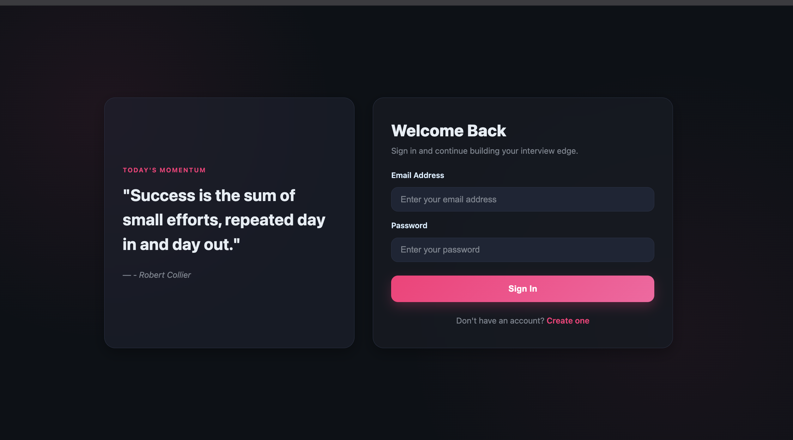
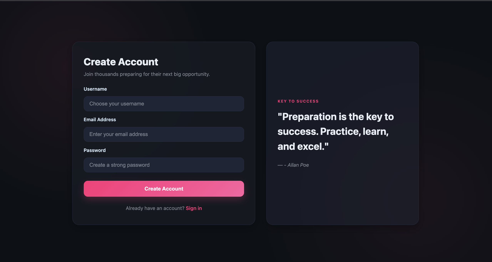
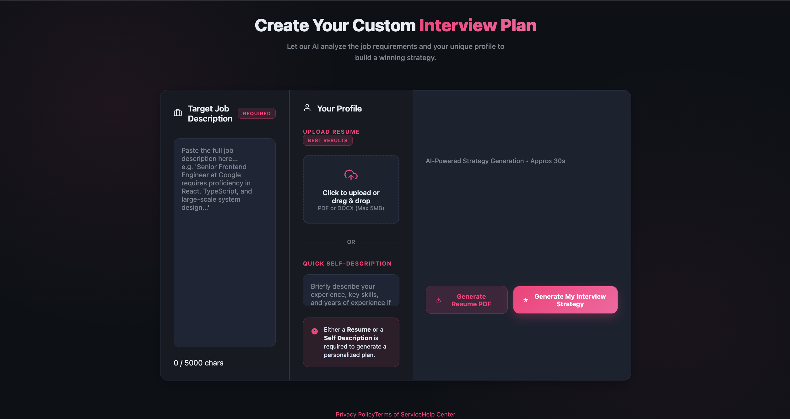
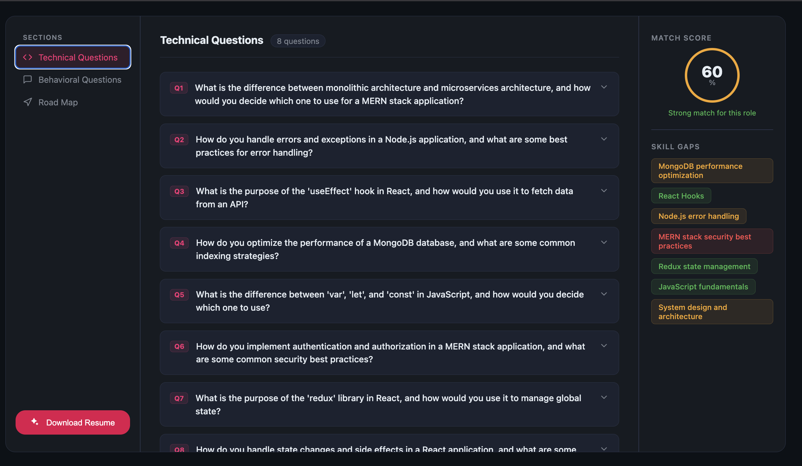

# 🚀 AI-Powered Interview Preparation Platform

 [](https://prep-ai-indol.vercel.app/)


An intelligent full-stack web application that helps users prepare for interviews by analyzing their **resume, job description, and self-reflection**. The system leverages **AI (Groq API)** to generate personalized insights, interview questions, and a structured preparation plan.

---

## 📸 Screenshots

### 🔐 Login Page


### 📝 Registration Page


### 📥 Input Section


### 📊 Report / Output


## 📌 Features

* 🧠 **AI-Generated Technical Questions**  
  Get role-specific technical questions based on your resume and job description.

* 💬 **Behavioral Questions**  
  Personalized behavioral interview questions tailored to your experience.

* 📊 **ATS / Match Score**  
  Evaluate how well your resume matches the job description.

* 📉 **Skill Gap Analysis**  
  Identify missing skills required for your target role.

* 🗺️ **Preparation Roadmap**  
  Receive a structured plan to improve and crack your interview.

* 📝 **Self-Reflection Input**  
  Incorporate personal insights to improve AI recommendations.

---

## 🛠️ Tech Stack

### Frontend
* React.js
* Axios

### Backend
* Node.js
* Express.js

### AI Integration
* Groq API

### Others
* REST APIs
* JSON-based data handling

---

## 🧩 How It Works

1. User inputs:
   * Resume
   * Job Description
   * Self-Reflection

2. Backend processes the data and sends it to Groq API

3. AI returns:
   * Technical Questions
   * Behavioral Questions
   * Skill Gaps
   * ATS Score
   * Preparation Plan

4. Results are displayed in a structured UI

---

## 📂 Project Structure


```
├── Frontend/        
├── Backend/       
├── README.md
```

---

## ⚙️ Installation & Setup

### 1. Clone the repository

```bash
git clone https://github.com/your-username/your-repo-name.git
cd your-repo-name
```

### 2. Setup Backend

```bash
cd server
npm install
```

Create a `.env` file:

```env
PORT=5000
GEMINI_API_KEY=your_api_key_here
MONGO_URI=
JWT_SECRET=
```

Run backend:

```bash
npm start
```

---

### 3. Setup Frontend

```bash
cd client
npm install
npm run dev
```

---

## 🔐 Environment Variables

| Variable       | Description           |
| -------------- | --------------------- |
| GEMINI_API_KEY | Google Gemini API Key |
| PORT           | Backend server port   |
| MONGO_URI      | MongoData base        |
|JWT_SECRET      | JWT secret key        |

---

## 🎯 Use Cases

* Students preparing for placements
* Job seekers targeting specific roles
* Developers improving interview readiness

---

## 🚧 Future Improvements

  
* Resume PDF-Generation 
* Mock interview simulation (real-time)
* Voice-based interview practice
* Advanced ATS scoring system


---


## 🙌 Acknowledgements

* Groq API
* Open-source community

---


